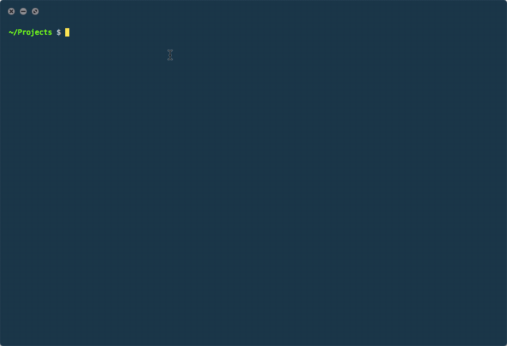

Don't waste time thinking about the perfect name for your project. Use `quickname` and start coding!

This small cli tool quickly creates your project folder with a randomly generated name.

## Demo



## Usage
```
$ npm install -g quickname

$ quickname

Use name dreary-hands ? (y/n) n
Use name hushed-cable ? (y/n) n
Use name ethereal-winter ? (y/n) y
Successfully created directory
  cd ethereal-winter
```
